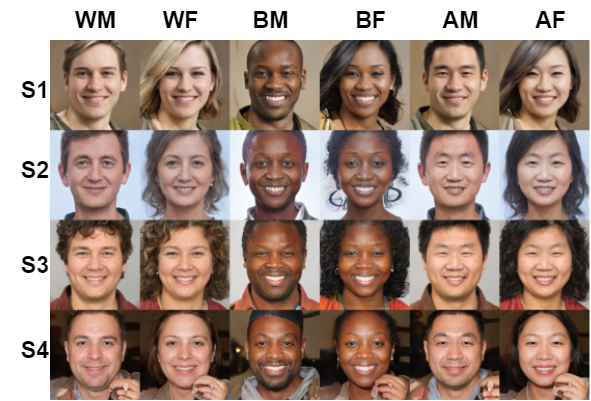

# Benchmarking Algorithmic Bias in Face Recognition  
*An Experimental Approach Using Synthetic Faces and Human Evaluation (ICCV 2023)*

## Overview
This repository accompanies the ICCV 2023 paper:

**Benchmarking Algorithmic Bias in Face Recognition: An Experimental Approach Using Synthetic Faces and Human Evaluation**  
Hao Liang (Rice University), Pietro Perona (Caltech & AWS), Guha Balakrishnan (Rice University)  
📄 [Paper]([https://openaccess.thecvf.com/content/ICCV2023/html/Liang_Benchmarking_Algorithmic_Bias_in_Face_Recognition_ICCV_2023_paper.html](https://openaccess.thecvf.com/content/ICCV2023/papers/Liang_Benchmarking_Algorithmic_Bias_in_Face_Recognition_An_Experimental_Approach_Using_ICCV_2023_paper.pdf))

We propose an **experimental framework** to measure algorithmic bias in face recognition using **synthetic face datasets** and **human perceptual annotations**.  
Unlike traditional observational benchmarks, our method manipulates attributes independently, enabling **causal conclusions** about bias.  

---

## Key Highlights
- **Synthetic Dataset**  
  - 10,200 synthetic identities  
  - 48,000 face pairs  
  - Balanced across **race (White, Black, East Asian)** and **gender (Male, Female)**  
  - Controlled edits of **pose, age, expression, and lighting**  

- **Human Consensus Identity Confidence (HCIC)**  
  - 555,000+ human annotations for both single-attribute labels and pairwise identity similarity  
  - Provides perceptual ground truth for benchmarking algorithms  

- **Findings**  
  - Popular face recognition models (SphereFace, ArcFace variants) show **lower accuracy for Black and East Asian subgroups** compared to White groups.  
  - Recognition performance is most sensitive to **pose** and **expression**, less so to lighting and age.  

---

## Dataset Access
Our full dataset of **synthetic faces and human annotations** is available for research use.  

📥 [Dataset](https://rice.app.box.com/s/0t7dtfurh8jf80mhq3f7s8nbya2g58w9)  

---

## Figures
### Prototypes Across Demographics
  

### Attribute Variations
  

---

## Citation
If you use our dataset or findings, please cite:
```bibtex
@inproceedings{liang2023benchmarking,
  title={Benchmarking algorithmic bias in face recognition: An experimental approach using synthetic faces and human evaluation},
  author={Liang, Hao and Perona, Pietro and Balakrishnan, Guha},
  booktitle={Proceedings of the IEEE/CVF International Conference on Computer Vision},
  pages={4977--4987},
  year={2023}
}
